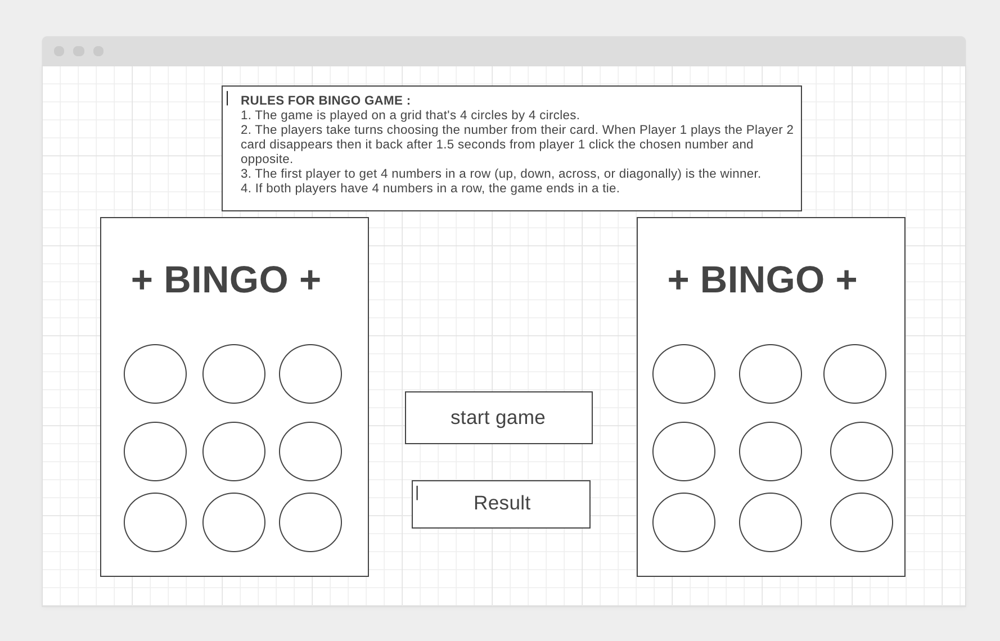

# Project 1 BINGO GAME 
----

## Technologies used

Visual Studio, HTML, CSS, JavaScript and jQuery

## Game Story
// need time 

## The rules for BINGO GAME :

1. The game is played on a grid that's 4 circles by 4 circles.

1. The players take turns choosing the number from their card. When Player 1 plays the Player 2 card disappears then it back after 1.5 seconds from player 1 click chosen number and opposite.

1. The first player to get 4 numbers in a row (up, down, across, or diagonally) is the winner.

1. If both players have 4 numbers in a row, the game ends in a tie.

## wireframe

[BINGO GAME wireframe](https://wireframe.cc/pro/pp/ba9544b46402557)

## Reference 

1. [w3schools](https://www.w3schools.com/)
1. [css-tricks](https://css-tricks.com/)
1. [stackoverflow](https://stackoverflow.com/)
1. [developer](https://developer.mozilla.org/)
1. [codepen](https://codepen.io/trending)
1. [geeksforgeeks](https://www.geeksforgeeks.org/)
1. [oscarotero](https://oscarotero.com/jquery/)
